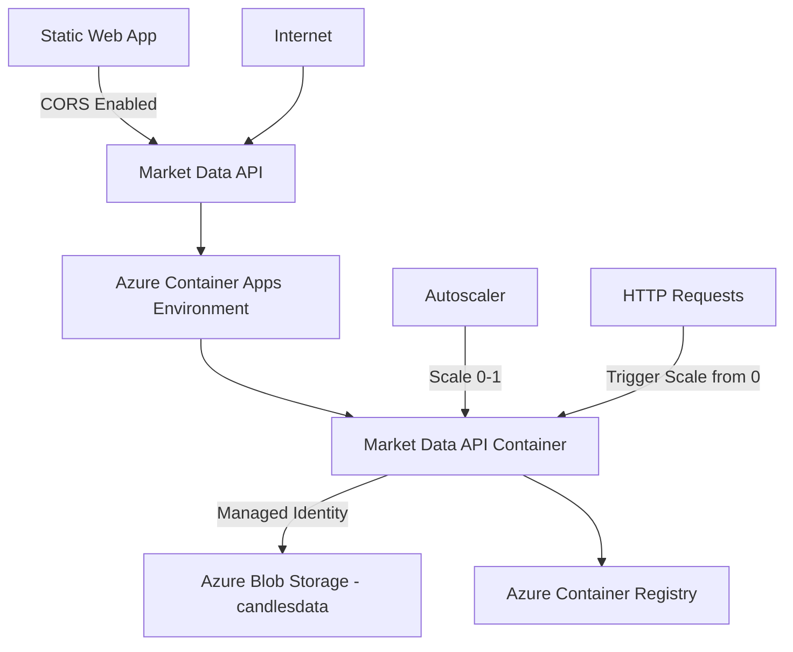
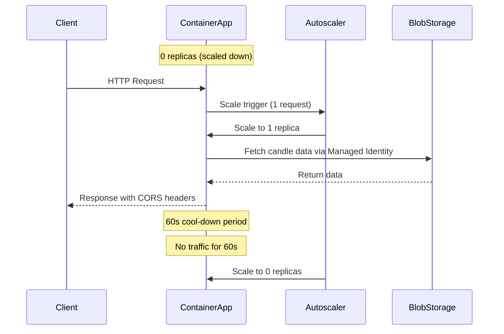

# Azure Container Apps Deployment Plan for Market Data API

## Overview

This document outlines the plan to deploy the `S3CandlesDemo.Api` project to Azure Container Apps with autoscaling configured from 0 to 1 instance. The deployment uses **Managed Identity** for secure Azure Blob Storage authentication and includes **CORS support** for the static web app frontend.

## Architecture



## Existing Azure Resources

| Resource Type | Name | Description |
|---------------|------|-------------|
| Storage Account | `candlesdata` | Azure Blob Storage with candle data (public internet access enabled) |
| Blob Container | `candles-data` | Container containing candle data files |

## Resource Naming Convention (New Resources)

| Resource Type | Name | Description |
|---------------|------|-------------|
| Resource Group | `marketdata-rg` | Contains all deployment resources |
| Container Registry | `marketdataacr` | Stores container images |
| Container Apps Environment | `marketdata-env` | Container Apps runtime environment |
| Container App | `marketdata-api` | The deployed API application |
| Managed Identity | `marketdata-identity` | Azure AD identity for Blob Storage authentication |

## Prerequisites

1. **Azure Subscription** - Active Azure subscription with appropriate permissions
2. **Azure CLI** - Installed and configured (`az login`)
3. **Docker** - For building and pushing container images
4. **Azure Storage Account** - `candlesdata` (already configured with candle data)
5. **Azure Container Registry (ACR)** - For storing container images (to be created)

## Deployment Architecture Components

| Component | Purpose |
|-----------|---------|
| Azure Container Apps | Serverless container orchestration with autoscaling |
| Azure Container Registry | Secure container image storage |
| Azure Blob Storage (`candlesdata`) | Candle data storage (already configured) |
| Azure Managed Identity | Secure authentication to Blob Storage without secrets |
| Azure Monitor | Metrics and logging for autoscaling |

## Code Changes Required

### Update Azure Blob Storage Authentication to Use Managed Identity

The [`AzureBlobCandlesRepository.cs`](S3CandlesDemo.Candles/AzureBlobCandlesRepository.cs) and [`Program.cs`](S3CandlesDemo.Api/Program.cs) need to be updated to use Azure AD authentication instead of connection strings.

**Required NuGet Package:**
```xml
<PackageReference Include="Azure.Identity" Version="1.11.4" />
```

**Updated Configuration in appsettings.json:**
```json
{
  "StorageType": "azure",
  "AzureBlob": {
    "Container": "candles-data",
    "Prefix": "candles",
    "StorageAccountName": "candlesdata"
  }
}
```

## Step-by-Step Deployment Plan

### Phase 1: Code Updates

#### 1.1 Add Azure.Identity Package
Add the Azure.Identity package to the API project for managed identity authentication.

#### 1.2 Update Program.cs
Modify the `CreateAzureBlobRepository` method to use `DefaultAzureCredential` instead of connection string.

#### 1.3 Update AzureBlobCandlesRepository.cs
Add a constructor that accepts a `BlobServiceClient` authenticated with managed identity.

### Phase 2: Infrastructure Setup

#### 2.1 Create Resource Group
```bash
az group create --name marketdata-rg --location westeurope
```

#### 2.2 Create Azure Container Registry (ACR)
```bash
az acr create --resource-group marketdata-rg --name marketdataacr --sku Basic --admin-enabled true
```

#### 2.3 Create Container Apps Environment
```bash
az containerapp env create --name marketdata-env --resource-group marketdata-rg --location westeurope
```

#### 2.4 Create and Configure Managed Identity
```bash
# Create managed identity
az identity create --name marketdata-identity --resource-group marketdata-rg

# Get the storage account resource ID
STORAGE_ID=$(az storage account show --name candlesdata --resource-group candles --query id -o tsv)

# Get the managed identity principal ID
IDENTITY_PRINCIPAL=$(az identity show --name marketdata-identity --resource-group marketdata-rg --query principalId -o tsv)

# Grant Storage Blob Data Reader role to the managed identity
az role assignment create --assignee $IDENTITY_PRINCIPAL --scope $STORAGE_ID --role "Storage Blob Data Reader"
```

### Phase 3: Container Image Preparation

#### 3.1 Build and Push Container Image
```bash
# Login to ACR
az acr login --name marketdataacr

# Build the image
docker build -f Dockerfile.api -t marketdataacr.azurecr.io/marketdata-api:latest2 .

# Push to ACR
docker push marketdataacr.azurecr.io/marketdata-api:latest2
```

### Phase 4: Container App Deployment

#### 4.1 Deploy Container App with Managed Identity and CORS
```bash
# Get the managed identity client ID
IDENTITY_CLIENT_ID=$(az identity show --name marketdata-identity --resource-group marketdata-rg --query clientId -o tsv)

# Deploy Container App with autoscaling, managed identity, and CORS
az containerapp create \
  --name marketdata-api \
  --resource-group marketdata-rg \
  --image marketdataacr.azurecr.io/marketdata-api:latest \
  --environment marketdata-env \
  --ingress external \
  --target-port 8080 \
  --min-replicas 0 \
  --max-replicas 1 \
  --registry-server marketdataacr.azurecr.io \
  --assign-identity marketdata-identity \
  --identity-client-id $IDENTITY_CLIENT_ID \  
  --cors-allowed-origins "https://market-data-dv.azurestaticapps.net" \
  --cors-allowed-methods "GET,POST,PUT,DELETE,OPTIONS" \
  --cors-allowed-headers "*" \
  --cors-expose-headers "*" \
  --cors-allow-credentials true
```

#### 4.2 Configure Autoscaling Rules
```bash
az containerapp autoscale config create \
  --name marketdata-api \
  --resource-group marketdata-rg \
  --min-replicas 0 \
  --max-replicas 1 \
  --cool-down 60 \
  --rule-name http-rule \
  --metric-name http-request \
  --metric-threshold 1
```

### Phase 5: Verification and Testing

#### 5.1 Verify Deployment
```bash
# Check container app status
az containerapp show --name marketdata-api --resource-group marketdata-rg

# Get the external endpoint
az containerapp show --name marketdata-api --resource-group marketdata-rg --query properties.configuration.ingress.fqdn
```

#### 5.2 Test API Endpoints
```bash
# Get the endpoint
ENDPOINT=$(az containerapp show --name marketdata-api --resource-group marketdata-rg --query properties.configuration.ingress.fqdn -o tsv)

# Test symbols endpoint
curl "https://$ENDPOINT/candles/symbols"

```

## Autoscaling Configuration Details

### Scaling Rules

| Parameter | Value | Description |
|-----------|-------|-------------|
| Min Replicas | 0 | Scale to zero when no traffic |
| Max Replicas | 1 | Maximum of one instance |
| Scale Trigger | HTTP Request Count >= 1 | Any incoming request triggers scale-up |
| Cool Down | 60 seconds | Time before scaling down after traffic stops |

### Scaling Behavior



## Environment Variables Configuration

| Variable | Value | Source |
|----------|-------|--------|
| `StorageType` | `azure` | Environment variable |
| `AzureBlob:Container` | `candles-data` | Environment variable |
| `AzureBlob:Prefix` | `candles` | Environment variable |
| `AzureBlob:StorageAccountName` | `candlesdata` | Environment variable |
| `ASPNETCORE_URLS` | `http://+:8080` | Dockerfile default |

## CORS Configuration

| Setting | Value | Description |
|---------|-------|-------------|
| Allowed Origins | `https://<your-static-web-app>.azurestaticapps.net` | Your Static Web App domain |
| Allowed Methods | `GET, POST, PUT, DELETE, OPTIONS` | HTTP methods for API access |
| Allowed Headers | `*` | All headers allowed |
| Expose Headers | `*` | All headers exposed to client |
| Allow Credentials | `true` | Allow cookies/credentials |

## Security Considerations

1. **Managed Identity**: Uses Azure AD authentication - no secrets or connection strings in code
2. **RBAC**: Managed identity has only "Storage Blob Data Reader" role (read-only access)
3. **HTTPS**: Container Apps provides automatic TLS certificates for public endpoints
4. **CORS**: Configured to only allow requests from your Static Web App domain
5. **ACR Authentication**: Use private ACR with managed identity pull permissions

## Cost Optimization

1. **Scale to Zero**: No charges when no traffic (0 replicas)
2. **Single Replica**: Maximum of 1 instance limits concurrent costs
3. **AOT Compilation**: Faster cold starts reduce scale-up latency costs
4. **Chiseled Image**: Smaller image size reduces pull time and storage costs

## Monitoring and Logging

### Azure Monitor Integration
- Enable Application Insights for detailed telemetry
- Configure log streaming for real-time debugging
- Set up alerts for:
  - Scale events (0 to 1, 1 to 0)
  - HTTP 5xx errors
  - High latency requests
  - Managed Identity authentication failures

### Key Metrics to Monitor
- Request count
- Response time
- Scale events
- Container CPU/Memory usage
- Blob Storage access latency

## Rollback Strategy

1. **Image Versioning**: Tag images with version numbers (e.g., `v1.0.0`, `v1.0.1`)
2. **Quick Rollback**: Use `az containerapp update --image <previous-image-tag>`
3. **Health Checks**: Monitor API health endpoint before and after deployment

## Troubleshooting

### Common Issues

| Issue | Solution |
|-------|----------|
| Container fails to start | Check logs: `az containerapp logs show --name marketdata-api --resource-group marketdata-rg` |
| Blob Storage access denied | Verify managed identity has "Storage Blob Data Reader" role on `candlesdata` |
| CORS errors | Verify the Static Web App origin is in the allowed origins list |
| Slow cold starts | Ensure AOT compilation is enabled, check image size |
| Scale to zero not working | Verify cool-down period and no background traffic |

## Files to Create

1. **Bicep/ARM Template** (Optional): Infrastructure as Code for reproducible deployments
2. **GitHub Actions Workflow**: CI/CD pipeline for automated builds and deployments
3. **Environment-specific configurations**: Development, staging, production settings

## Next Steps

1. Review and approve this deployment plan
2. Update code to use Managed Identity for Azure Blob Storage
3. Create Azure resources (Resource Group, ACR, Container Apps Environment, Managed Identity)
4. Assign RBAC role to Managed Identity
5. Build and push container image to ACR
6. Deploy Container App with autoscaling and CORS configuration
7. Test API endpoints and verify CORS from Static Web App
8. Set up monitoring and alerting

## References

- [Azure Container Apps Documentation](https://learn.microsoft.com/azure/container-apps/)
- [Container Apps Autoscaling](https://learn.microsoft.com/azure/container-apps/autoscaling)
- [Scale to Zero Guide](https://learn.microsoft.com/azure/container-apps/scale-to-zero)
- [Managed Identity Authentication](https://learn.microsoft.com/azure/active-directory/managed-identities-azure-resources/)
- [Azure Blob Storage with Managed Identity](https://learn.microsoft.com/azure/storage/blobs/authentication-managed-identity-dotnet)
- [Container Apps CORS](https://learn.microsoft.com/azure/container-apps/cors)
